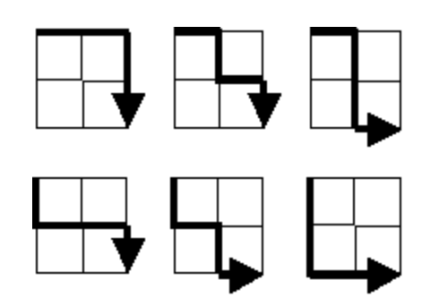

I have only just begun partially compiling this list during my free time. So to state all the solutions here will take quite a bit of time.

#Project Euler (Solutions)

Language: Pari/GP

#### Problem 1: Multiples of 3 or 5
	tot = 0; for(i=1,1000, if(i%3==0||i%5==0, tot=tot+i);); print(tot)
	234168
	##
	  *** last result: cpu time 1 ms, real time 3 ms.

#### Problem 2: Sum of even Fibonacci numbers below  4000000 

	? i=1; k = fibonacci(i); 
	tot = 0; 
	while(k<4000000, if(k%2==0, tot=tot+k); 
	i+=1; k = fibonacci(i);); print(tot);
	
	4613732
	? ##
 	 ***   last result: cpu time 0 ms, real time 0 ms.

Alternatively, if you want to be a purist, you can generate the Fibonacci sequence yourself: 

	? fib(n) = my(val=1,var=0); 
	for(k=1,n, tot= val+var; var = val; val = tot;); 
	return(Vec(fiblist));

#### Problem 4. Find the largest palindromic number that is the product of two three digit polynomials.

* To see if a number is a palindrome:

		rev(n)= my(l = length(digits(n)), m = listcreate(), d = 
		digits(n));forstep(i=l,1,-1, s = l-i+1; 
		listinsert(m,d[i],s);); return(Vec(m));
		
		ispal(n) = if(digits(n) == rev(n), return(1), return(0));

* 		l=1;forstep(i = 999,100,-1, forstep(j=999,100,-1, if(ispal(i*j)==1 && 	i*j>l,k= i*j;); l=k;)); 			print(k);
* 	 Answer: 906609

#### Problem 12: Highly divisible triangle numbers

The nth triangle number is expressed as 

$$ T_n = \sum_{k=1}^n k.$$ We are to find the smallest value of $n$ for which $T_n$ has over 500 divisors.

	? triangle(n) = my(tot=0); for(i=1,n, tot+=i); return(tot);
	? k=0; n = 0; while(n==0, k= k+1; n = length(divisors(triangle(k)))>500;); print(triangle(k));
	76576500
	? ##
  	***   last result: cpu time 24,075 ms, real time 24,152 ms.

#### Problem 15: Lattice paths

For a given $$2\times 2$$ grid, the number of possible paths from the upper left vertex (start) to the lower right vertex (end), such that at every step of the path, you are closer to the vertex is given as below:

There are $$6$$ paths in total. 

How many paths for a $$20\times 20$$ grid? 

This one can in principle do this using pen and paper. Note that for an $$n\times n$$ grid, the number of "vertically down paths" and the number of "horizontally right paths" are both $$n$$ (meaning, you need to go "down" $$n$$ times, and go "right" $$n$$ times). Let a vertical path be denoted $$0$$ and a horizontal path be denoted $$1$$. Therefore every path from 
start to end is an array of $$0$$'s and $$1$$'s, with the $$0$$'s and $$1$$'s appearing $$n$$ times. The simplest ones are the following: $$p_0 = [0,\cdots ,0,1,\cdots ,1]$$ (or $$p =  [1,\cdots, 1,0,\cdots, 0]$$) where the number of zeroes and ones are both $$n$$. The number of all possible paths is simply the number of array permutations of $$p_0$$ (keeping in mind that the zeroes and ones are not identical), which is given by 

$$\# P_n \ = \frac{(2n)!}{n!\times n!}.$$

	? paths(n) = factorial(2*n)/(factorial(n)*factorial(n))
	? for(i=1,20, print("P_",i,":",paths(i)* precision(1., 1)))
	
	P_1:2.000000000000000000
	P_2:6.000000000000000000
	P_3:20.000000000000000000
	P_4:70.00000000000000000
	P_5:252.00000000000000000
	P_6:924.0000000000000000
	P_7:3432.000000000000000
	P_8:12870.000000000000000
	P_9:48620.00000000000000
	P_10:184756.00000000000000
	P_11:705432.0000000000000
	P_12:2704156.000000000000
	P_13:10400600.000000000000
	P_14:40116600.00000000000
	P_15:155117520.00000000000
	P_16:601080390.0000000000
	P_17:2333606220.000000000
	P_18:9075135300.000000000
	P_19:35345263800.00000000
	P_20:137846528820.00000000
	
	? ##
  	***   last result: cpu time 0 ms, real time 0 ms.

Question: The numbers listed above $$P_i, i = 1,\cdots,20$$ are integers. Is this always the case? If yes, why? If not, when does it fail?

#### Problem 146: Investigating a prime pattern

The smallest positive integer for which the numbers $$n^2+k, k = 1,3,7,9,13,27$$ are consecutive primes is $$10$$. The sum of all such integers below one-million is $$1242490$$. What is the sum of all such integers below 150 million?

A brute force approach is as follows: 

	? tot = 0; for(i=1,150000000, if(isprime(i^2+1)==1 && isprime(i^2+3)==1 && isprime(i^2+7)==1 && isprime(i^2+9)==1 && isprime(i^2+13)==1 && isprime(i^2+27)==1 && length(primes([i^2+1,i^2+27]))==6, tot=tot+i);); print(tot);
	676333270
	? ##
 	 ***   last result: cpu time 1min, 39,533 ms, real time 1min, 39,869 ms.

This of course does not hold under Project Euler's requirement that the solutions should be obtained in under 1 minute. So some tinkering is needed. 

This is done in the following way. 

 - We can see that for $$n^2+1 \in \mathbb P$$, $$n \equiv 1 \bmod 2$$ [else, $$n^2 + 1 \equiv 0 \bmod 2$$].
 - We can see that $$n \not \equiv 1 \bmod 5$$ [else $$n^2 + 9 \equiv 0 \bmod 5$$].
 - We can see that $$n \not \equiv 2 \bmod 5$$ [else $$n^2 + 1 \equiv 0 \bmod 5$$].
 - We can see that $$n \not \equiv 3 \bmod 5$$ [else $$n^2 + 1 \equiv 0 \bmod 5$$].
 - We can see that $$n \not \equiv 4 \bmod 5$$ [else $$n^2 + 9 \equiv 0 \bmod 5$$].
 - So $$n \equiv 0 \bmod 2,5$$. 

Using the Chinese Remainder Theorem, we have that $$n \equiv 0 \bmod 10$$. 

	? tot = 0; forstep(i=0,150000000,10,if(isprime(i^2+1)==1 && isprime(i^2+3)==1 && 
	isprime(i^2+7)==1 && isprime(i^2+9)==1 && isprime(i^2+13)==1 
	&& isprime(i^2+27)==1 && length(primes([i^2+1,i^2+27]))==6, 
	tot=tot+i);); print(tot);
	676333270
	? ##
 	 ***   last result: cpu time 14,988 ms, real time 15,024 ms.

#### Problem 231

Now this one is a bit tricky. On the face of it, it seems simple. 
